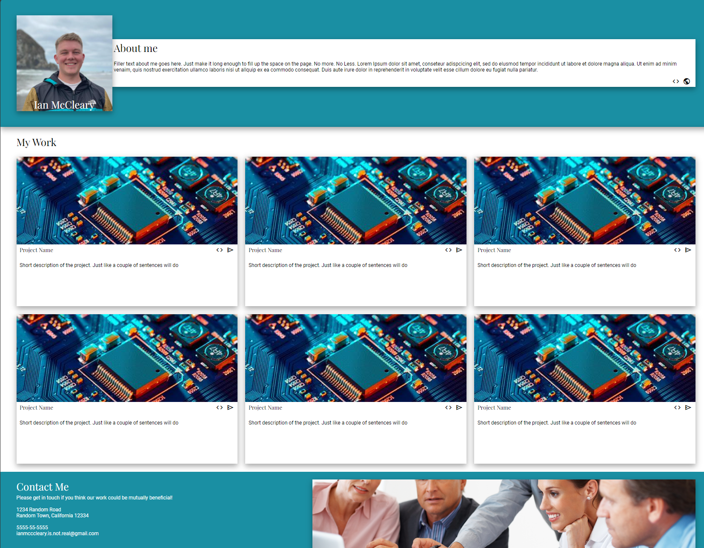
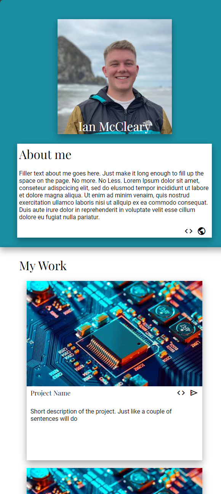
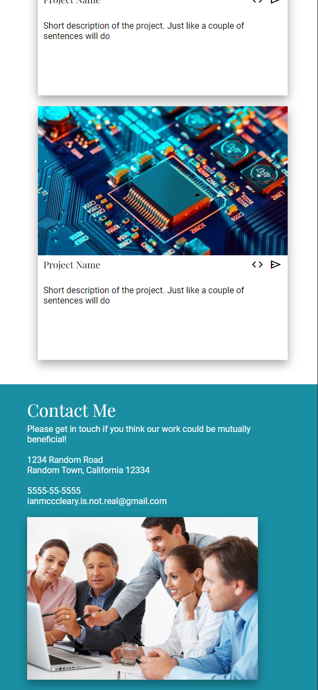

Link to project: https://www.theodinproject.com/lessons/node-path-advanced-html-and-css-homepage

## Project Description
### Introduction
For your final HTML/CSS project, you’re going to create a responsive homepage, something you might find on a portfolio site of sorts. When you get to the point that you want to start sharing your work, or applying for jobs, it’s useful to have a well-designed portfolio to share. While we won’t be making one yet, you’ll want practice with these more advanced HTML and CSS concepts first, so take this as an opportunity to practice them!

Similarly to landing page and admin dashboard from previous projects, you are tasked to build a given design brief. We’re providing a full design in 3 different sizes, full desktop, tablet and mobile, and this is the first real project where you should take your time and make sure that it looks acceptable at any screen size.

Feel free to pick your own fonts and colors and use something other than a stock-photo for your header. The main focus is on achieving the specified layouts and responsive behaviour rather than a complete portfolio.

### Assignment
Step 1: Set up and planning
Set up your HTML and CSS files with some dummy content, just to make sure you have everything linked correctly.
Download a full-resolution copy of the design files (desktop design file, tablet design file, mobile design file), and get a general idea for how you’re going to need to lay things out in your HTML document.
Step 2: Gather assets
The portraits we’ve used in the design files are stock photos downloaded from pexels.com. If you don’t have a picture of yourself handy, feel free to go grab a placeholder for now.
Select your fonts! We’re using Playfair Display and Roboto in the design, both available with Google fonts.
In the design we have icon-links for GitHub, LinkedIn and X (formerly known as Twitter). Obviously feel free to add whatever links you want to your own site. We got those icons from https://devicon.dev/.
Other icons (phone, email and external link) were downloaded as SVGs from https://materialdesignicons.com/.
Step 3: Some tips!
As you might expect, you can organize your work on this project however you please. We’ve given you many tips over the past several lessons, and you are likely already comfortable starting from a blank page.
If you like being told what to do: The author of this lesson feels most comfortable starting out with the larger sections of the layout, and then working from the top of the page to the bottom. In other words, get the various sections in more or less the right place (header, projects, contact etc.) while ignoring a lot of specific style and content details, then go back through from the top-to-bottom filling-in, styling and cleaning up everything.
It doesn’t matter when or how you accomplish the responsiveness of this project. There are people who will tell you that you should always start with the mobile experience and then use media-queries to tell your layout how to expand. The ‘mobile-first’ crew does have some good points (Google it!) but in the end, how you accomplish it doesn’t matter as long as it works. Good luck!
When you’re done, don’t forget to push it to GitHub, and use GitHub Pages to publish it to the world! You should be proud of what you’ve accomplished here!
Step 4: Give your feedback
Before you move on, we would love it if you could send us your feedback on the Advanced HTML and CSS course. Getting user (you) feedback is important so we can continue to improve the curriculum and get an idea of your experience.

### Objective Image Desktop

### Objective Image Tablet

### Objective Image Mobile

### Result Image Desktop

### Result Images Mobile

