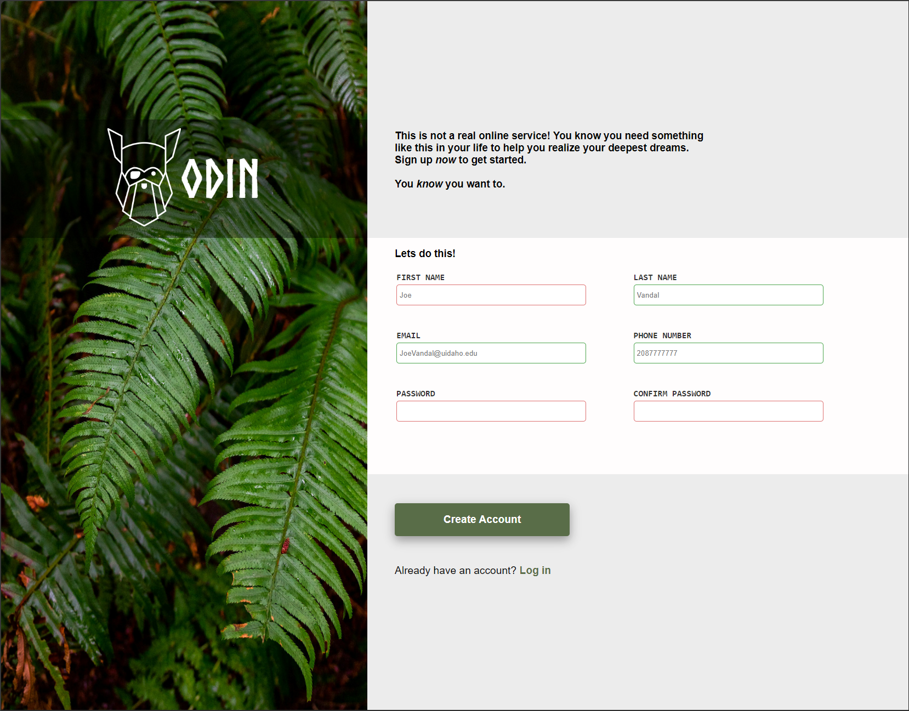

Link to project: https://www.theodinproject.com/lessons/node-path-intermediate-html-and-css-sign-up-form

## Project Description
### Introduction
This project is intended to give you a chance to flex some of the new items you’ve been absorbing over the past few lessons. This time it’s a sign-up form for an imaginary service.

### Assignment
Step 1: Set up and planning
Set up your git repository (refer to past projects if you need a refresher).
Set up your HTML and CSS files with some dummy content, just to make sure you have everything linked correctly.
Download a full-resolution copy of the design file, and get a general idea for how you’re going to need to lay things out in your HTML document.
Step 2: Gather assets
The design has a large background-image, so go find and download an image you want to use for that section. The one in the design can be found on unsplash.com, but feel free to select your own. Be sure to credit the creator of your image!
Pick an external font for the ‘logo’ section. We’ve used Norse Bold, but you can use any font you like.
For the image-sidebar, we’ve used this Odin logo.
Step 3: Some tips!
How you attack this project is mostly up to you, but it is wise to begin by scaffolding out the structure of the page, and then tackle the various sections one by one.
The area behind the “ODIN” logo is a div that has a dark, but semi-transparent background color. This enhances the readability of the text against the busy background image.
The color we’ve chosen for the ‘Create Account’ button is similar to tones found in the background image. Specifically, it is #596D48.
The inputs, by default have a very light border (#E5E7EB), but we’ve included 2 variations. For starters, the password inputs should have a red border if they contain an invalid password. This can be handled with the :invalid pseudo-class you’ve learned in the previous lesson.
The other variation is the selected input, which should have a blue border and subtle box-shadow. This can be done with the :focus pseudo-class you’ve learned about in an earlier lesson.
Do not worry about making your project look nice on mobile. Responsive design isn’t covered until later in the curriculum.
Validating that the password fields match each other requires JavaScript. Using JavaScript to validate forms is covered in a future lesson. For now, just validate each field separately.

### Objective Image

### Result Image
