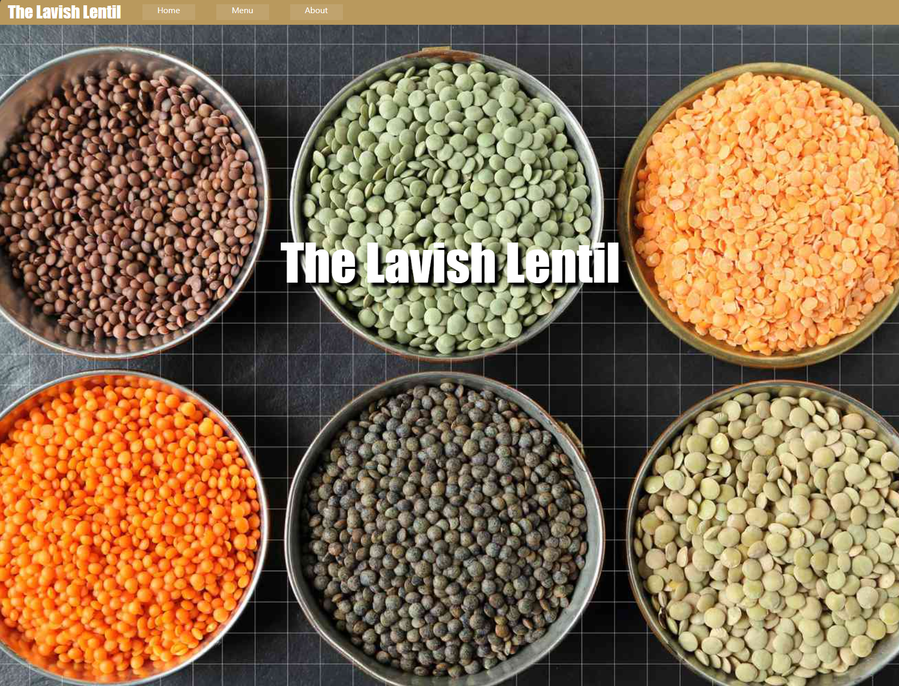
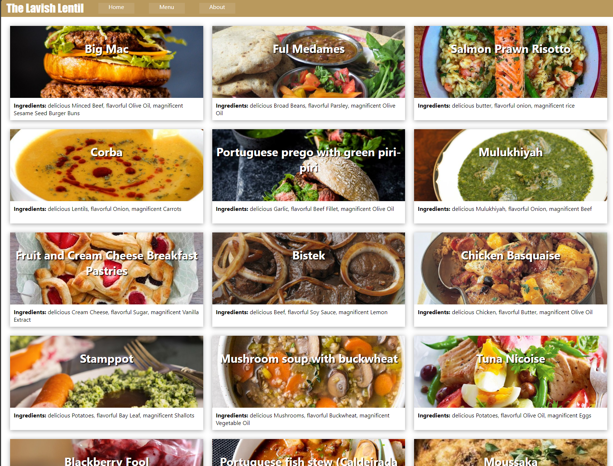

Project Link: https://www.theodinproject.com/lessons/node-path-javascript-restaurant-page

## Project Description
This project was almost the exact same as the shop project from the react course so I did not spend too much time making the style look nice.
### Introduction
Let’s use what we’ve learned and take a chance to continue practicing DOM manipulation by dynamically rendering a restaurant homepage! By the end, we are going to be using JavaScript alone to generate the entire contents of the website!

Note: DOM elements should be created using JavaScript but styling can be done in a separate CSS file.

### .gitignore
When working with packages that are installed with npm, you don’t need to track the contents of node_modules with git, nor push those files to GitHub. As we learned in the npm lesson, the package.json file contains all the dependency information, so that anyone can clone your project and install them on their machine with npm install.

You can make a .gitignore file in the root of the project, and by writing file or directory names in it, you can tell git what things you don’t want to track. It’s customary to add node_modules to .gitignore, since it can get really big. Similarly, dist is often ignored as it can be generated when someone runs the command to bundle/build the application.

When creating a new repo on GitHub, there is an option to specify a .gitignore template. There are many templates out there that include common files and directories that are not typically tracked based on the type of project or language used. For JavaScript projects, there is a node template that includes node_modules and dist.

### Assignment
Start the project the same way you began the webpack tutorial project, by creating the package.json file and setting up Webpack.
Remember, you only need to install and configure the things you need for your project. For example, if you do not plan to have local image files linked in your HTML template, you will not need to install and configure html-loader.
Create a .gitignore file in the root of your project. It should contain the text node_modules and dist on separate lines.

Set up an HTML skeleton inside of src/template.html. Inside the body, add a <header> element that contains a <nav> with buttons (not links!) for different “tabs” (for example buttons for “Home”, “Menu” or “About” etc). Below the <header>, add a single 
.
Inside of src/index.js write a console.log or alert statement and then run npx webpack serve. Open https://localhost:8080 in your browser and check your JavaScript is running.
Inside div#content, create a homepage for your restaurant. You might want to include an image, headline, and some text about how wonderful the restaurant is; you do not have to make this look too fancy. It’s okay to hard-code these into the HTML for now just to see how they look on the page.
Now remove everything inside div#content from the HTML (so you still have the <header> and <nav> with an empty 
 below it) and instead create them by using JavaScript only, e.g. by appending each new element to div#content once the page is first loaded. Since we’re all set up to write our code in multiple files, let’s write this initial page-load function inside of its own module and then import and call it inside of index.js.
Next, set up your restaurant site to use tabbed browsing to access the Menu and Contact pages. Look at the behavior of this student’s live preview site for visual inspiration.
Put the contents of each “tab” inside of its own module. Each module will export a function that creates a div element, adds the appropriate content and styles to that element and then appends it to the DOM.
Write the tab-switching logic inside of index.js. You should have event listeners for each button in the header navbar that wipes out the current contents of div#content and then runs the correct ‘tab module’ to populate it with the new contents again.
Let’s deploy to GitHub pages! First, we will need to bundle our application into dist by running npx webpack. Unfortunately, we need to do a little more work to deploy to GitHub pages, because GitHub Pages tries to look for an index.html in the root of your project, but yours is inside dist! We will need to do a few steps to push the contents of your dist directory to its own branch on GitHub, which will then have a root-level index.html for GitHub pages to serve.
Follow the instructions in this gist about deploying your dist subdirectory to GitHub pages. EZPZ!
Recall that the source branch for GitHub Pages is set in your repository’s settings. Get this changed to the gh-pages branch.

### `npm start`

Runs the app in the development mode.\
Open [http://localhost:3000](http://localhost:3000) to view it in the browser.

The page will reload if you make edits.\
You will also see any lint errors in the console.

### Result Images
#### Home

#### Menu

#### About

