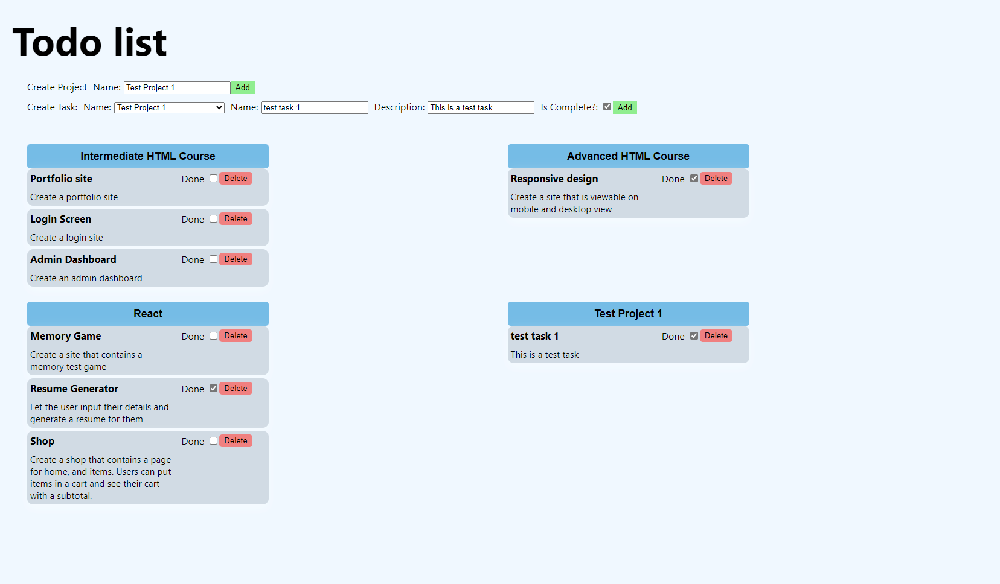
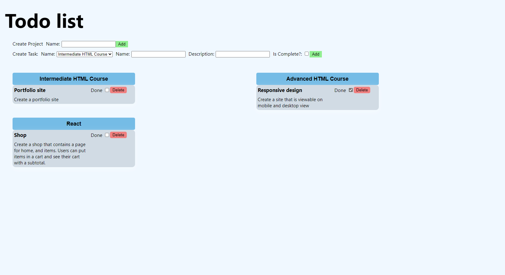

Project Link: https://www.theodinproject.com/lessons/node-path-javascript-todo-list

## Project Description
### Introduction
At this point you’ve already had a fair amount of practice using the various techniques we’ve shown you. But we’ve been throwing a lot of information your way, so before we move on we’re going to take a minute to slow down and work on another great project that ties these techniques together. You should have the chance to show off most (if not all) of your newfound skills!

### The todo list
Todo lists are a staple in beginning webdev tutorials, the implementation can be basic. There is, however, a lot of room for improvement and many features that can be added.

Before diving into the code, take a minute to think about how you are going to want to organize your project.

### Assignment
Your ‘todos’ are going to be objects that you’ll want to dynamically create, which means either using factories or constructors/classes to generate them.
Brainstorm what kind of properties your todo-items are going to have. At a minimum they should have a title, description, dueDate and priority. You might also want to include notes or even a checklist.
Your todo list should have projects or separate lists of todos. When a user first opens the app, there should be some sort of ‘default’ project to which all of their todos are put. Users should be able to create new projects and choose which project their todos go into.
You should separate your application logic (i.e. creating new todos, setting todos as complete, changing todo priority etc.) from the DOM-related stuff, so keep all of those things in separate modules.
The look of the User Interface is up to you, but it should be able to do the following:
View all projects.
View all todos in each project (probably just the title and duedate… perhaps changing color for different priorities).
Expand a single todo to see/edit its details.
Delete a todo.
For inspiration, check out the following great todo apps. (look at screenshots, watch their introduction videos etc.)
Todoist
Things
any.do
Since you are probably already using webpack, adding external libraries from npm is a cinch! You might want to consider using the following useful library in your code:
date-fns gives you a bunch of handy functions for formatting and manipulating dates and times.
We haven’t learned any techniques for actually storing our data anywhere, so when the user refreshes the page, all of their todos will disappear! You should add some persistence to this todo app using the Web Storage API.
localStorage allows you to save data on the user’s computer. The downside here is that the data is ONLY accessible on the computer that it was created on. Even so, it’s pretty handy! Set up a function that saves the projects (and todos) to localStorage every time a new project (or todo) is created, and another function that looks for that data in localStorage when your app is first loaded. Additionally, here are a couple of quick tips to help you not get tripped up:
Make sure your app doesn’t crash if the data you may want to retrieve from localStorage isn’t there!
You can inspect data you saved in localStorage using DevTools! To do this, open the Application tab in DevTools and click on the Local Storage tab under Storage. Every time you add, update and delete data from localStorage in your app, those changes will be reflected in DevTools.
localStorage uses JSON to send and store data, and when you retrieve the data, it will also be in JSON format. Keep in mind you cannot store functions in JSON, so you’ll have to figure out how to add methods back to your object properties once you fetch them. Good luck!

In the project directory, you can run:

### `npm start`

Runs the app in the development mode.\
Open [http://localhost:3000](http://localhost:3000) to view it in the browser.

The page will reload if you make edits.\
You will also see any lint errors in the console.

### Result Images
#### Initial site

#### Adding a project

#### Adding tasks to a project

#### Removing tasks from a project
