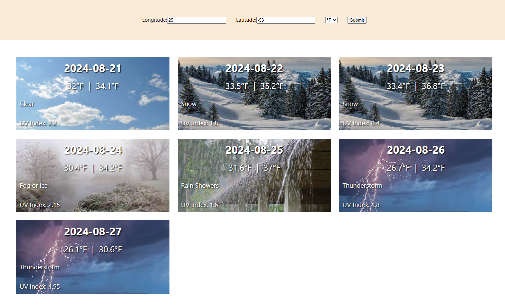

Project Link: https://www.theodinproject.com/lessons/node-path-javascript-weather-app

## Project Description
### Note
I am not signing up to get API keys so I found a free API that let me use longitude and latitude instead of search by location.
### Introduction
Use everything we’ve been discussing to create a weather forecast site using the Visual Crossing API from previous lessons. You should be able to search for a specific location and toggle displaying the data in Fahrenheit or Celsius.

You should change the look of the page based on the data, maybe by changing the color of the background or by adding images that describe the weather. (You could even use the Giphy API to find appropriate weather-related gifs and display them). Feel free to use promises or async/await in your code, though you should try to become comfortable with both.

### API keys, secrets, and security
Not all APIs are free, and depending on how they’re set up, they can cost money per use. This makes them a prime target for people looking to use the API without paying by using your API key. They can also be rate-limited, and if someone has access to your API key they can use up all of your uses. One way to prevent this issue is to store your API keys on the server and never send them to the frontend in the first place, this is often done using environment variables and it makes the key available only on the server the code is deployed to.

When talking about API keys and security you’ll often hear “Never trust the client” (client meaning the frontend). Often this means not to trust that data coming from the client is valid, but it also means that you cannot trust anything we send to the client. Because of this, when you leak an API key, Github will alert you that you have committed an API key publicly. After following this project, and indeed exposing the API key, you may notice that Github will send you this alert. This is totally OK for this project as this API key is publicly available and there is no consequence for exposing it. This is not to say ALL keys are this way. Later during the backend courses you will learn ways to securely deal with these topics.

### Assignment
Set up a blank HTML document with the appropriate links to your JavaScript and CSS files.
Write the functions that hit the API. You’re going to want functions that can take a location and return the weather data for that location. For now, just console.log() the information.
Write the functions that process the JSON data you’re getting from the API and return an object with only the data you require for your app.
Set up a form that will let users input their location and will fetch the weather info (still just console.log() it).
Display the information on your webpage!
Add any styling you like!
Optional: add a ‘loading’ component that displays from the time the form is submitted until the information comes back from the API. Use DevTools to test for low-end devices.
Push that baby to github and share your solution below!

### `npm start`

Runs the app in the development mode.\
Open [http://localhost:3000](http://localhost:3000) to view it in the browser.

The page will reload if you make edits.\
You will also see any lint errors in the console.

# Result Images

