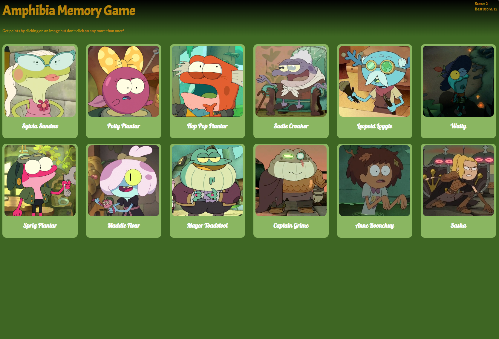

Link to project: https://www.theodinproject.com/lessons/node-path-react-new-memory-card

## Project Description
### Introduction
Here we go again with a new project! Let’s make sure you understand the concepts so far. The main goal of this project is to implement the concepts learned so far by using hooks to manage and utilize state while fetching and using data from an external API.

### How the game works
Go play around with this student’s solution to find out for yourself how the Memory game works. Although this example uses cartoon characters, you can use anything you like for your game.

### Assignment
Create a new React Project.
Take some time to think about the features you want to implement, which components you need, how to structure your application, and how to get the images from an API. Your application should include a scoreboard, which counts the current score, and a “Best Score”, which shows the highest score you’ve achieved thus far. There should be a function that displays the cards in a random order anytime a user clicks one. Be sure to invoke that function when the component mounts.
You also need a handful of cards that display images and possibly informational text. These cards and texts need to be fetched from an external API. You can use anything from Giphy to a Pokemon API.
Now that you’ve thought about the structure of your application, set up the folder structure and start creating the components.
Style your application so you can show it off!
As always, push the project to GitHub, and don’t forget to deploy it.

### `npm start`

Runs the app in the development mode.\
Open [http://localhost:3000](http://localhost:3000) to view it in the browser.

The page will reload if you make edits.\
You will also see any lint errors in the console.

### Objective Image

