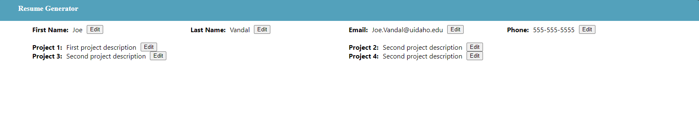
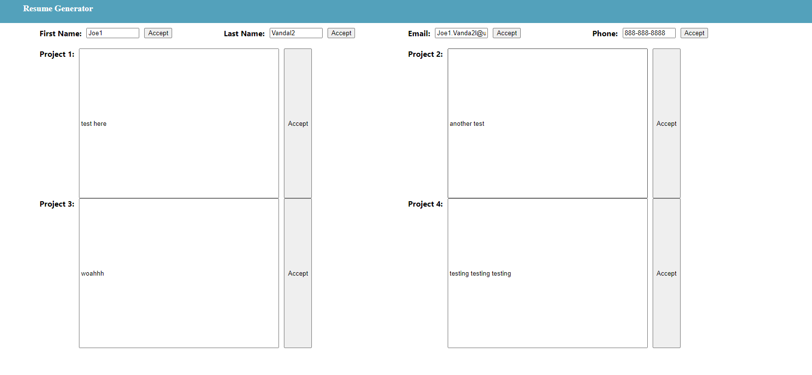

Link to project: https://www.theodinproject.com/lessons/node-path-react-new-cv-application

## Project Description
### Introduction
Congratulations, you have made it to the very first React project. In this project, you will be creating a small application where users can input their information and generate a CV/résumé. It’s a great project to get you started because it includes many of the basic concepts you’ve learned so far, without a huge overhead of complexity.

### Assignment
Double rendering
While working on this project, you might notice that some parts of your code execute twice (e.g., console logs appearing doubled). This is due to React.StrictMode and is intended behavior. We will go through this more in the next lesson, so don’t worry about it for now.

Create a new React project.
Think about how to structure your application into components. Your application should include:
A section to add general information like name, email and phone number.
A section to add your educational experience (school name, title of study and date of study)
A section to add practical experience (company name, position title, main responsibilities of your jobs, date from and until when you worked for that company)
Be sure to include an edit and submit button for each section or for the whole CV. The submit button should submit your form and display the value of your input fields in HTML elements. The edit button should add back (display) the input fields, with the previously displayed information as values. In those input fields, you should be able to edit and resubmit the content. You’re going to make heavy use of state and props, so make sure you understood those concepts.
Create a components directory under your src directory and add your components.
Include a styles directory under your src directory for your CSS files. You’ll need to import these in the component files to use them.
Push the results and deploy them with any of the options mentioned below. At this point of the curriculum, it doesn’t matter which platform you choose as long as your project is live on the internet!

### Objective Image
No objective image supplied so I made this bare bones to demonstrate react component states.

### Result Image

## Available Scripts

In the project directory, you can run:

### `npm start`

Runs the app in the development mode.\
Open [http://localhost:3000](http://localhost:3000) to view it in the browser.

The page will reload if you make edits.\
You will also see any lint errors in the console.

