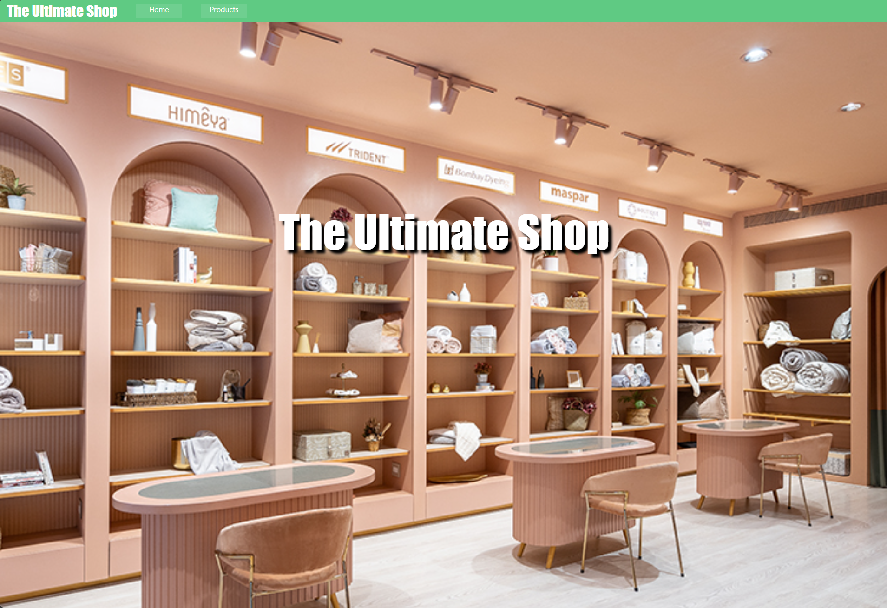
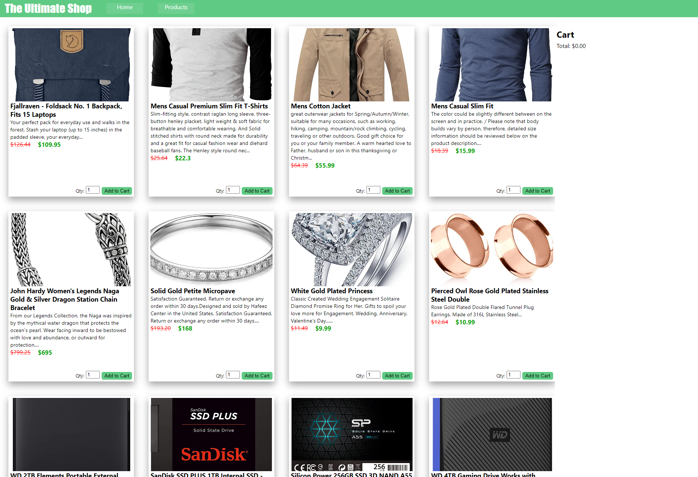
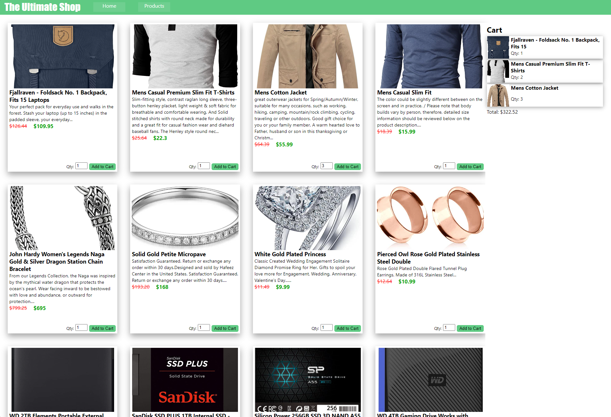

Project Link: https://www.theodinproject.com/lessons/node-path-react-new-shopping-cart

## Project Description
### Introduction
By now you’ve come far from your React-baby days. You have tools like routers and testing frameworks under your belt but you still have a long way to go. Now is a great time to put these concepts to use with a classic project - a mock shopping cart.

### Assignment
Create a new React project.
Think about the component and the folder structure. How could you set up your application? Which components or functionalities do you need? It’s a good idea to note this down somewhere you can easily get to and refer back and add to it to keep track.
You should have at least two pages (a home page and a shop page, which includes your shopping cart). Let the user navigate between the pages with a navigation bar, which will be shown on both pages.
To your homepage, you can add whatever you’d like! A few images or information will be totally fine; it doesn’t have to be something fancy - it’s to test the concepts taught thus far.
On the shopping cart page, you should have the same navigation bar that displays the number of items currently in the cart. You should also have a button next to it where you can go to the cart to checkout and pay (however we are not going to implement this logic here).
Build individual card elements for each of your products. Display an input field on it, which lets a user manually type in how many items they want to buy. Also, add an increment and decrement button next to it for fine-tuning. You can also display a title for each product as well as an “Add To Cart” button.
Fetch your shop items from FakeStore API or something similar.
Once a user has submitted their order, the amount on the cart itself should adjust accordingly.
Make sure to test your app thoroughly using the React Testing Library. Be careful not to test react-router-dom directly, since it is an external library and the developers working on it must have tested the library already.
As usual, style your application so you can show it off! You have a host of options provided already.
Lastly, it’s time to deploy it! Depending on what hosting solution you’re using, you may need some additional configuration so that your routing is handled correctly as a single page application (SPA).

Netlify: You need to add a _redirects file to the public/ directory of your project. Copy the following to redirect all routes to the index page and let react-router-dom handle the rest. You can read more about this at the Netlify documentation on redirects.

/* /index.html 200
Vercel: You need to add a vercel.json file at the root of your project and copy the following configuration. Similar to Netlify, this redirects all routes to the index page and lets react-router-dom handle the rest. More information can be found here at the Vercel documentation for SPAs and Vite.

{
  "rewrites": [
    {
      "source": "/(.*)",
      "destination": "/index.html"
    }
  ]
}
Cloudflare Pages: As of the time of writing, unlike Netlify and Vercel, no additional steps are required as the default behaviour will allow react-router-dom to correctly handle redirects for SPAs. You can learn more about this at the Cloudflare documentation on serving pages.

### `npm start`

Runs the app in the development mode.\
Open [http://localhost:3000](http://localhost:3000) to view it in the browser.

The page will reload if you make edits.\
You will also see any lint errors in the console.

### Result Images
#### Home

#### Products

#### Products with items in cart
